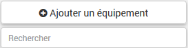
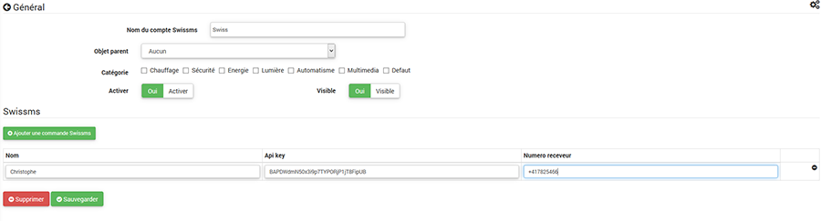
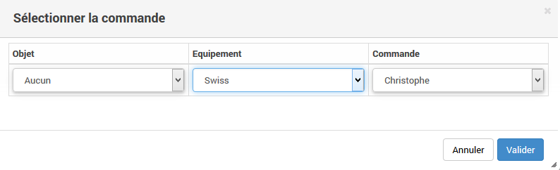

Description 
===========

Ce plugin permet d'envoyer des SMS via l'opérateur SWISSCOM

Installation
=============

- Pour utiliser le plugin il faut aller [ici](https://docs.developer.swisscom.com/api-service-offerings/smart-messaging.html) , et suivre la procédure pour créer un compte et générer une clé API.

Utilisation
===========

Créer un nouvel équipement en cliquant sur le +

En cliquant sur "ajouter un équipement" ou sur le "+"

Sur l’équipement vous pouvez dorénavant configurer les informations

**Nom** : Par exemple, configurer le nom du destinataire

**Customer Key** : la clé API que vous avez créé

**Numéro d'appel**:  le numéro qui va recevoir le SMS

Ensuite vous pouvez sélectionner la commande pour l'utiliser dans un scénario

Et paramétrer un message prédéfini dans un scénario avec le message dans "valeur"

En cas de soucis , voir sur le forum ==> [ici](https://www.jeedom.com/forum/viewtopic.php?f=140&t=6142)

